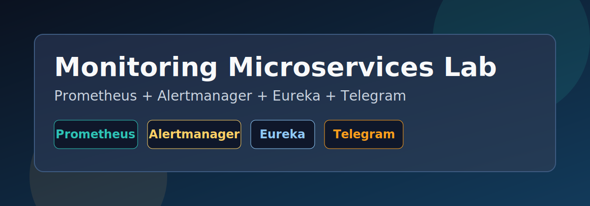

# Monitoring Microservices Lab



(https://drive.google.com/file/d/11isV6SAGw_zbJ2KMxN8hBd9B65hMk4Fk/view?usp=sharing)

Plataforma de observabilidad para microservicios Spring Boot registrados en Eureka, con recoleccion de metricas en Prometheus y notificaciones de alertas via Alertmanager + Telegram.

## Contenido

- [Resumen](#resumen)
- [Stack Tecnologico](#stack-tecnologico)
- [Estructura del Proyecto](#estructura-del-proyecto)
- [Requisitos](#requisitos)
- [Configuracion](#configuracion)
- [Inicio Rapido](#inicio-rapido)
- [Operacion](#operacion)
- [Seguridad](#seguridad)
- [Checklist para Publicar](#checklist-para-publicar)

## Resumen

Este laboratorio de monitoreo incluye:

- Descubrimiento de microservicios desde Eureka.
- Scraping de metricas con Prometheus.
- Reglas de alerta centralizadas.
- Envio de alertas a Telegram usando Alertmanager.
- Configuracion sensible desacoplada mediante variables de entorno.

## Stack Tecnologico

- Prometheus
- Alertmanager
- Docker Compose
- Eureka Service Discovery
- Telegram Bot API

## Estructura del Proyecto

- [docker-compose.yml](docker-compose.yml): orquestacion de servicios.
- [prometheus/prometheus.yml](prometheus/prometheus.yml): jobs y scraping de metricas.
- [prometheus/alertas.yml](prometheus/alertas.yml): reglas de alerta.
- [alertmanager/config.yml](alertmanager/config.yml): ruteo y mensaje de notificaciones.
- [data/](data/): almacenamiento local de Prometheus (no versionar).

## Requisitos

- Docker
- Docker Compose
- Red Docker externa llamada `network_docker`

Crear la red (solo una vez):

```bash
docker network create network_docker
```

## Configuracion

1. Crea tu archivo `.env` local en la raiz del proyecto.
2. Define como minimo estas variables:

```env
PROMETHEUS_VERSION=latest
ALERTMANAGER_VERSION=latest

TOKEN_TELEGRAM=REPLACE_WITH_TELEGRAM_BOT_TOKEN
CHAT_ID_TELEGRAM=REPLACE_WITH_TELEGRAM_CHAT_ID

EUREKA_SERVER_dev=http://IP_DEV:8761/eureka
USERNAME_EUREKA_DEV=REPLACE_WITH_DEV_USER
PASSWORD_EUREKA_DEV=REPLACE_WITH_DEV_PASSWORD

EUREKA_SERVER_qa=http://IP_QA:8761/eureka
USERNAME_EUREKA_QA=REPLACE_WITH_QA_USER
PASSWORD_EUREKA_QA=REPLACE_WITH_QA_PASSWORD

EUREKA_SERVER_prod=http://IP_PROD:8761/eureka
USERNAME_EUREKA_PROD=REPLACE_WITH_PROD_USER
PASSWORD_EUREKA_PROD=REPLACE_WITH_PROD_PASSWORD
```

3. Verifica que `.env` no este versionado.

## Inicio Rapido

Levantar servicios:

```bash
docker compose up -d
```

Estado de contenedores:

```bash
docker compose ps
```

## Operacion

Logs de Alertmanager:

```bash
docker compose logs --tail=100 alertmanager
```

Recargar configuracion de Prometheus (hot reload):

```bash
curl -X POST http://localhost:9090/-/reload
```

Detener stack:

```bash
docker compose down
```


